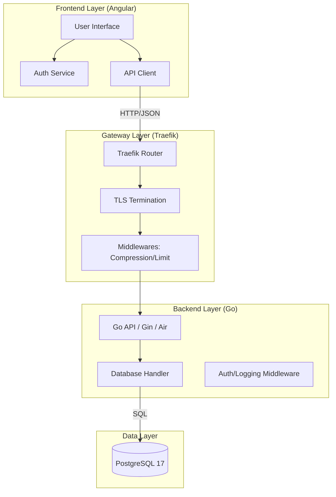
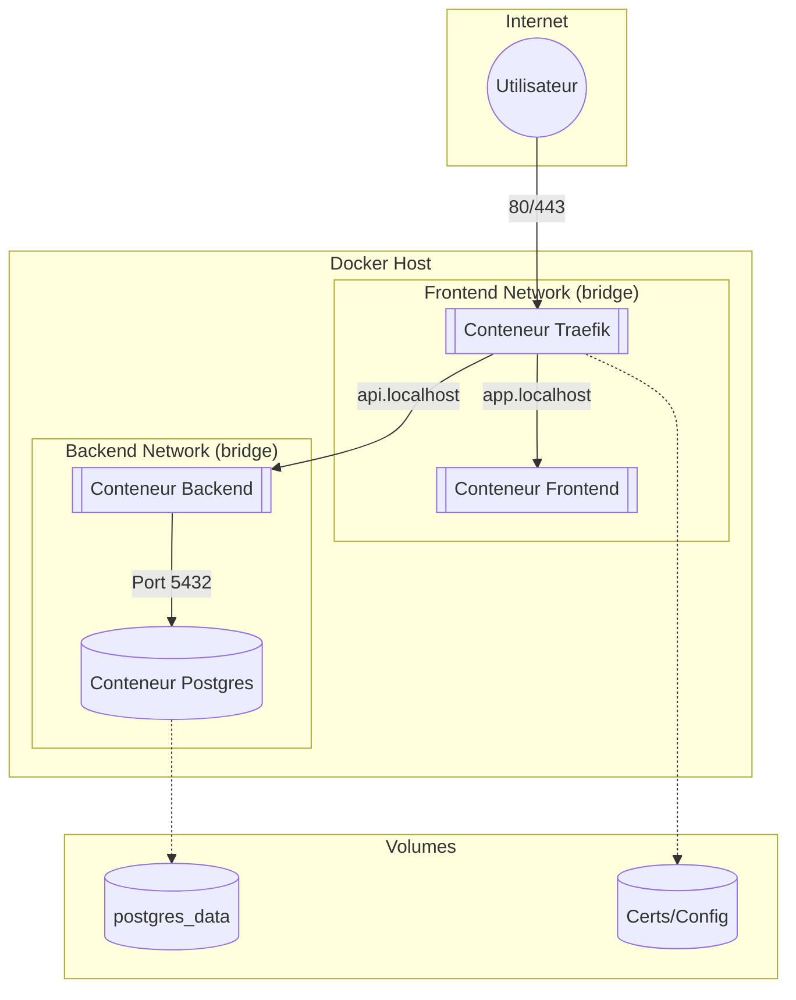

# Diagramme de Composants (Logique)
Ce diagramme montre comment les briques logicielles communiquent entre elles, indépendamment de l'infrastructure.

# Diagramme de Déploiement (Infrastructure Docker)
Ce diagramme montre comment les conteneurs sont isolés dans leurs réseaux respectifs et comment le trafic circule à travers les ports.

### Isolation Réseau :

La Database est totalement isolée du monde extérieur. Seul le Backend peut lui parler via le backend_network.
Traefik sert de point d'entrée unique (Reverse Proxy) pour le Frontend et le Backend.

### Flux de Données :

Le trafic entrant arrive sur Traefik (Port 80/443).
Traefik analyse le Host (ex: api.localhost) et redirige vers le bon conteneur.
Note : Ton Backend appartient aux deux réseaux car il doit être joignable par Traefik (pour l'API) et doit pouvoir joindre la Database.

### Persistance :

Les données de la base sont stockées dans un volume nommé pour survivre au redémarrage des conteneurs.

## Justification des choix techniques

- **Go + Gin** : adapté aux API REST légères, facile à compiler en binaire, bon support de conteneurisation et une structure claire pour gérer la logique métier, les routes, les middleware et les repositories.
- **Angular** : cadre structuré pour une application métier, gestion facilitée des composants, des formulaires, des routes et des guards d'authentification.
- **PostgreSQL** : base de données relationnelle solide pour gérer des tickets, des utilisateurs et des relations entre entités.
- **Docker Compose** : orchestration simple pour le développement et la production, avec isolation réseau, volumes persistants et health checks.
- **Traefik** : reverse proxy qui centralise le routage HTTP et TLS, permet de séparer l’accès frontend/backend et de rendre l’architecture plus professionnelle.
- **Health checks** : `/api/v1/health` et `/healthz` garantissent que Docker compose peut redémarrer automatiquement un service défaillant.
- **Métriques** : l’endpoint `/api/v1/metrics` expose des informations Prometheus-like pour suivre la santé applicative et les KPI métier.
